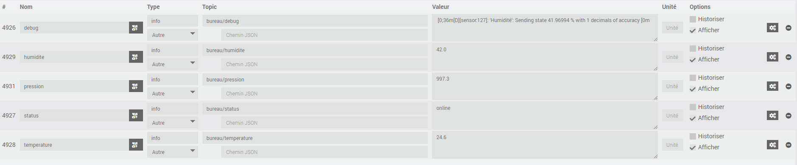

# Ajout du capteur environnemental

Le capteur environnemental est accessible via le bus I2C, il y a deux bus sur le M5StickCPlus
j'ajoute les deux en leurs donnant deux IDs différents.

```
i2c:
   - id: bus_a
     sda: GPIO21
     scl: GPIO22
     scan: true
   - id: bus_b
     sda: GPIO0
     scl: GPIO26
     scan: true

```

Le capteur nous donne la température, l'humidité et la pression, j'ajoute donc ces éléments en spécifiant 
le topic MQQT ( state_topic )

```
sensor:
  - platform: sht3xd
    i2c_id: bus_b
    temperature:
      name: "Température"
      state_topic: $devicename/temperature
      id: temperature
    humidity:
      name: "Humidité"
      state_topic: $devicename/humidite
      id: humidite
    address: 0x44
    update_interval: 60s
  - platform: qmp6988
    temperature:
      id: idNull
    pressure:
      name: "Pression"
      oversampling: 16x
      state_topic: $devicename/pression
      id: pression
    address: 0x70
    i2c_id: bus_b
    update_interval: 60s
    iir_filter: 2x
```

Je lance la commande `esphome run base_i2c.yaml` et ça donne automatiquement dans MQTT




