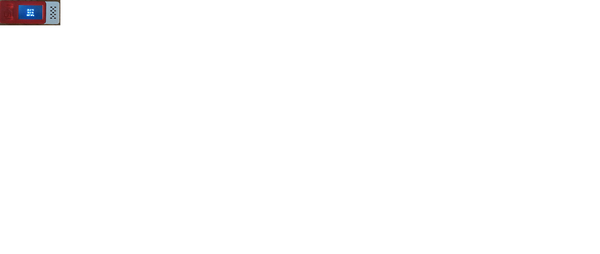

# Ajout d'un display

Le capteur environnemental est accessible via le bus SPI, je l'ajoute.

```
spi:
  clk_pin: GPIO13
  mosi_pin: GPIO15

```
J'ajoute une police de caratères et la liste de caractères à utiliser ( par défaut c'est sans les caractères accentués ),
le fichier arial.ttf doit se trouver dans le répertoire du fichier de configuration.

```
font:
  - file: 'arial.ttf'
    id: fontArial
    size: 20
    glyphs: '!"%()+,-_.:°0123456789ABCDEFGHIJKLMNOPQRSTUVWXYZ abcdefghijklmnopqrstuvwxyz/³µéèçàêëö'

```

J'ajoute quelques couleurs

```
color:
  - id: red
    red: 100%
    green: 0%
    blue: 0%
  - id: yellow
    red: 100%
    green: 100%
    blue: 0%
  - id: green
    red: 0%
    green: 100%
    blue: 0%
  - id: blue
    red: 0%
    green: 0%
    blue: 100%
  - id: white
    red: 100%
    green: 100%
    blue: 100%

```

Et enfin le display

```
display:
  - platform: st7789v
    id: tDisplay
    model: TTGO TDisplay 135x240
    cs_pin: GPIO5
    dc_pin: GPIO23
    reset_pin: GPIO18
    update_interval: 5s
    rotation: 270
    lambda: |-

      char str[16];
      if (id(temperature).has_state()) {
        sprintf(str, "%.1f °C", id(temperature).state);
        it.print(120, 45, id(fontArial), blue, TextAlign::CENTER, str);
      }
      if (id(humidite).has_state()) {
        sprintf(str, "%.1f %%", id(humidite).state);
        it.print(120, 70, id(fontArial), blue, TextAlign::CENTER, str);
      }
      if (id(pression).has_state()) {
        sprintf(str, "%.0f hPa", id(pression).state);
        it.print(120, 95, id(fontArial), blue, TextAlign::CENTER, str);
      }
```

Et ça donne

